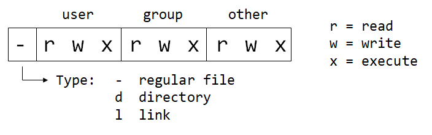

# Users and Permissions

```bash
# USER vs ROOT
username@machineName:~$  # $-sign: logged in as admin (user)
username@machineName:~#  # #-sign: logged in as superuser (root user)

# changing between root and user
whoami             # echos current user
sudo -su root      # switches to root user
sudo -s            # switches to root user (same command)
sudo -su <user>    # switches to <user>
cat /etc/passwd    # show all users

# ADD NEW USER (when being logged in as root)
sudo usernew <username>  # creates new user
sudo deluser <username>  # deletes user
passwd <user>            # changes password of <user>
passwd                   # changes password of current user!
```

**Permission Encoding**



```bash
# EXAMPLES
# encoding     # description
-rwxrwxrwx 777 # read, write and execute for all users    
-rwxr-xr-x 755 # read/execute for all users. Owner has alos write permission
-rwxr-x--- 750 # read/execute for owner and group. Owner has also write permission
-rwx------ 700 # read/write/execute only for the owner
-rw-rw-rw- 666 # read/write for all
-rw-rw-r-- 664 # read for all. write only for owner and group.
-rw-rw---- 660 # read/write only for owner and group
-rw-r--r-- 644 # read for all. Owner can write also.
-rw-r----- 640 # read for owner and group only. Owner can also write.
-rw------- 600 # read/write for owner only
-r-------- 400 # read for owner only. No permission for anybody else.
```

### Change Permissions (2 ways: numeric or symbolic)

```bash
# numeric syntax (-R = rekursive)
chmod 777 <dir>     # permission 777 for <dir> 
chmod -R 777 <dir>  # permission 777 for <dir> and all subdir & files inside
chmod 777 <file>    # permission 777 for <file>

# symbolic syntax: X, W or E for U(ser), G(roup), O(ther) or A(ll)
chmod a+xwe <dir>  # add all permission for all
chmod u+e <file>   # add execute permission only for user
chmod a-e <file>   # remove execute permission for all users
chmod a-wr <file>  # remove write and read permission for all users
```
