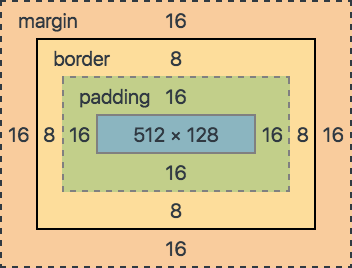

# CSS Box Model



- margin (Platz ausserhalb vom Rand)
- border (Rand)
- padding (Platz zwischen Rand und Inhalt)
- content (Inhalt)

### Example

```css
div {
	padding: 10px;
	border: 2px;
	margin: 10px;
}
```