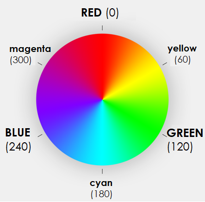

# HSL(a)

**IMPORTANT**: Better use [RGB](css_colors-rgb.md) or [HEX](css_colors-hex.md), since HSL is not supported in all versions of all browsers. 
- **Hue**: Value between 0-360. Degree on the color-circle:<br>`0:red, 120:green, 240:blue`.
- **Saturation**: Percentage 0-100% (or 0-1). Mixes the color with grey:<br>`100%:pure, 0%:grey`
- **Lightness**: Percentage 0-100% (or 0-1). Normal value is 50%:<br>`0%:black, 50%:normal, 100%: white`
- **a**: Percentage 0-100% (or 0-1). alpha-channel = opacity. Optional parameter, works the same as with [RGB](css_colors-rgb.md#alpha-channel-opacity): `0:transparent, 1:no-opacity`

```css
hsl(0,   1, 0.5)   /* =red   =rgb(255,0,0) */
hsl(120, 1, 0.5)   /* =green =rgb(0,255,0) */
hsl(240, 1, 0.5)   /* =blue  =rgb(0,0,255) */

/* percentage format*/ 
hsl(0,   100%, 50%)
hsl(120, 100%, 50%)
hsl(240, 100%, 50%)

/* with alpha channel (different levels) */
hsl(0, 100%, 50%, 0)
hsl(0, 100%, 50%, 0.1)
hsl(0, 100%, 50%, 1)    /* standard setting */
```

### Hue Saturation Lightness Overview


### Color Circle (Hue)

- `Red (0)`
- `Green (120)`
- `Blue (240)`


